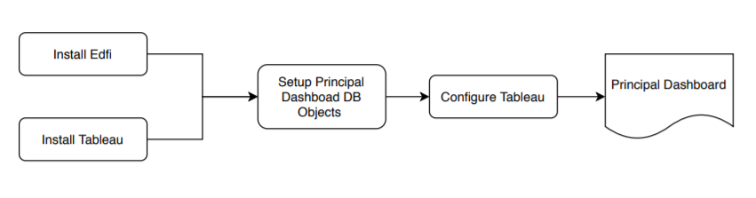
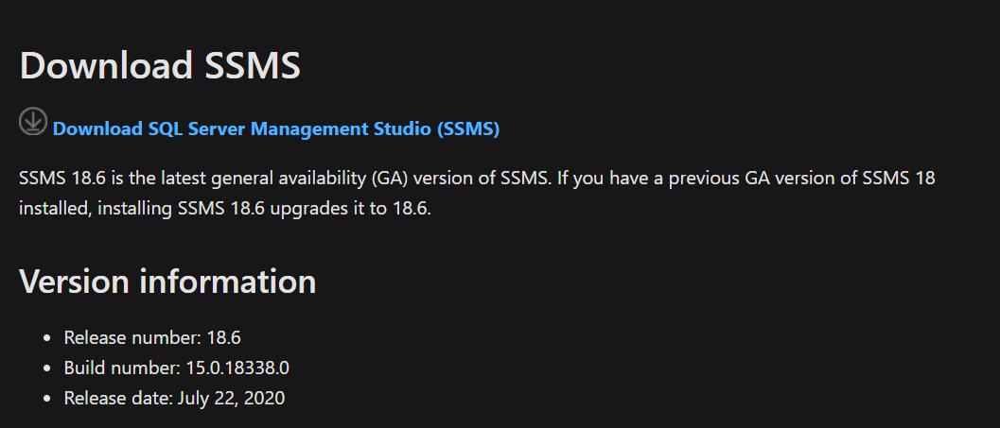
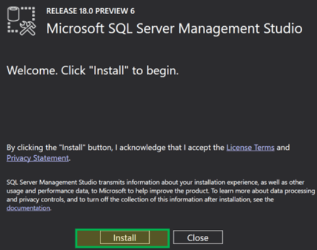
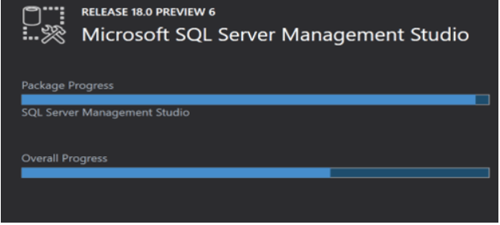
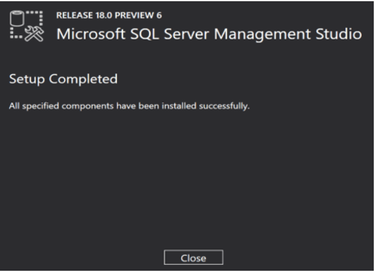
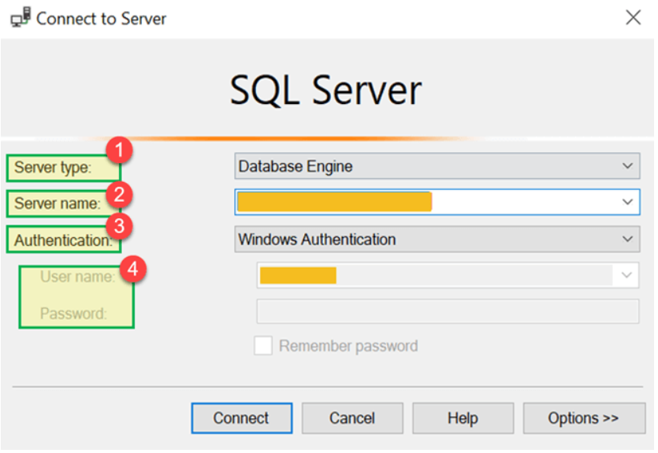
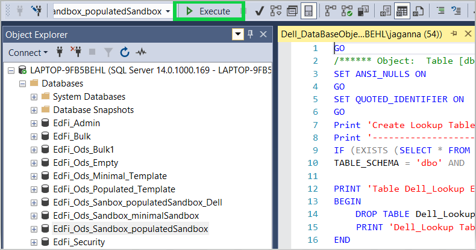
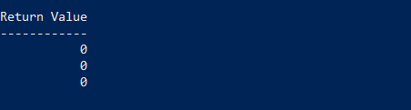
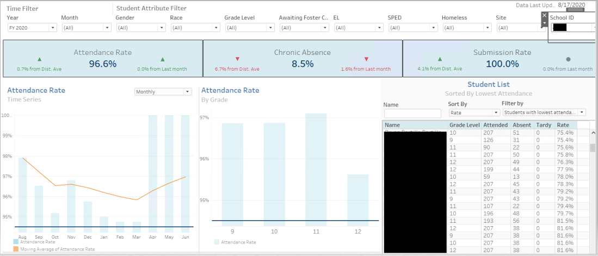

# Tableau-Attendance-Dashboard

# Project Title
 **Attendance dashboard for Principal**

# Project Descriptions
 The dashboard gives the Principal of the School detailed information on School Attendance enabling the Principal in better Operational decision making. The dashboard provides various perspectives on Attendance Rate and Chronic absenteeism helping the Principal evaluate the performance of the School and identify the students who have a poor attendance record or are trending negatively on the verge of being chronically absent. 

## Project Flow Architecture

## Prerequisites

        Step 1) Should have working setup of SSMS (SQL Server Management Studio 18.x).
        Step 2) Should have a working setup of Edfi v3.x (Preferrably v3.2 or v3.4) ODS setup. This application is compatible with v3.2 and v3.4.
                Follow the Instructions to Setup Edfi ODS in the Machine
                https://techdocs.ed-fi.org/display/ODSAPI32
        Step 3) Should have Administrator previlege to access the Edfi ODS Database Server.        
        Step 4) Should have EdFi_Ods_Populated_Template database configured as part of the EDFI ODS Installation.
        Step 5) Should have Sample data populated in the ODS for the following Tables
                a) Student
                b) schools
                c) CalendarDate
                d) StudentSchoolAttendanceEvent
                e) StudentSchoolAssociations
                f) Descriptors
        Step 6) Should have Tableau 2019 or higher version installed 

## Instllations Instructions

### Edfi Installation

        Step 1) Follow the instructions to Setup the Edfi ODS in the Machine
        https://techdocs.ed-fi.org/display/ODSAPI3/Getting+Started+-+Installation+Steps

        Step 2) The instructions will help you to setup following windows components and Sofwares that are required to build the Edfi ODS
                a) PowerShell 5.0
                b) Microsoft Message Queue Server Core
                c) .NET Framework 3.5
                d) Java Runtime Environment 8 or Higher. 
                e) Microsoft SQL Server 2014 or Higher Versions
                f) Visual Studio 2017 or 2015.

### SQL Server Management Studio

        Step 1) Go to this link https://docs.microsoft.com/en-us/sql/ssms/download-sql-server-management-studio-ssms?view=sql-server-ver15 and click on Download SQL Server Management Studio (preview 6)

        Step 2) Once downloaded we will get a .exe file named as "SSMS-Setup-ENU.exe." Double click on it

        Step 3) Click on 'Install.

        Step 4) Installation will begin.will show Packages progress and Overall Progress.

### Connect to SQL Server Using SSMS(Sql Server Management Studio)

        Database Connection Settings: 
        1) Server Type defaults to Database Engine
        2) Server Name - Select from the Installed Server
        3) Authentication - Leave as Windows Authentication

## Database Object Migrations:
 
        1) Open SQL Server Management Studio, Enter the connection details as mentioned in the previous section.
        2) Select the database that you want to setup the DB objects for Principal dashboard. In the following example EdFi_Ods_Populated_Template is used.

        3) In SQL Server Managment Studio select File -> Open -> Navigate to the location where the Dell_DataBaseObject.sql is downloaded
        4) Select the script and click on Execute

        5) This will create the following Objects in the database in the dbo Schema

        1) Tables
            *   Dell_Students

                    -   Students table stores all the Student related information, following are the key demographics that is captured in this table

                            *   English Learner
                            *   SPED
                            *   Homeless
                            *   Econoically Disadvantaged

                    -   Some of the Key Tables used are

                            *   Students
                            *   Descriptors

            *   Dell_Schools

                    -   All the demographics related to schools are captured in this table
                    -   Some of the Key Tables used are

                            *   schools
                            *   EducationOrganizations

            *   Dell_StudentAttendance

                    -   Captures students attendance information from StudentSchoolAttendanceEvent table
                    -   Based on the students enrollment, Students attendance information is updated in this table

            *   Dell_Lookup

                    -   Lookup Table that helps the user to customize the application as per their source system.
                    -   Attendance code and School Year can be controlled by updating the appropriate code to this table
                    -   ***Do Not Remove value Present from the Lookup Table **
					
                                By Default This Table is populated with the following Values
                                
                                For Attendance 
                                
                                        a) Present Lookup Code
                                                i) In Attendance
                                                ii) Partial
                                                iii) Tardy
                                                iV) Early departure
                                                
                                        b) Excused Absence
                                                i) Excused Absence
                                        
                                        c) Unexcused Absence
                                                i) Unexcused Absence
							
                                1) Insert Statement
                                
                                        To Insert any new values to this lookup table, please use the following format. Replace the values like 'In Attendance','Partial' etc from the following statement. This table maintains three different lookup values, Make sure all three values are updated or inserted.
							
                                INSERT INTO Dell_lookup
                                        VALUES
                                        (
                                        'PRESENT_LOOKUP_CODE','','','In Attendance',1,'','','','Y'),
                                        (
                                        'PRESENT_LOOKUP_CODE','','','Partial',1,'','','','Y'),
                                        (
                                        'PRESENT_LOOKUP_CODE','','','Tardy',1,'','','','Y'),
                                        (
                                        'PRESENT_LOOKUP_CODE','','','Early departure',1,'','','','Y'),
                                        (
                                        'EXABS_LOOKUP_CODE','','','Excused Absence',1,'','','','Y'),
                                        (
                                        'UNEXABS_LOOKUP_CODE','','','Unexcused Absence',1,'','','','Y')
						
                                2) Update Statement
                                
                                        One can inactivate the Attendance code by running the following update statement.
                                        
                                        UPDATE Dell_Lookup SET ACTIVE_FLG = < Input Values Here 'Y' OR 'N' > WHERE LOOKUP_CODE_DESC = < Any Existing Lookup Code >
						
					
					
                                For School Year
                                
                                        a) School Year
                                                i)      2010
                                                ii)     2011
                                                iii)    2012 
                                                
                                By Default 2011 is made active, Following statements to be used for updating or inserting any new school year to this lookup table
					
                                1) Insert Statements
                                
                                INSERT INTO Dell_lookup
                                        VALUES
                                        (
                                        'SCHOOL_YEAR','','','School Year',2010,'','','','N'),
                                        (
                                        'SCHOOL_YEAR','','','School Year',2011,'','','','Y'),
                                        (
                                        'SCHOOL_YEAR','','','School Year',2012,'','','','N')
                                        
                                
                                2) Update Statements for School Year
                                
                                UPDATE Dell_Lookup SET LOOKUP_VALUE = < Input Values Here > WHERE LOOKUP_VALUE = < Any Existing School Year >
                                
                                3) Update Statement for Active Flag
                                
                                UPDATE Dell_Lookup SET ACTIVE_FLG = < Input Values Here 'Y' OR 'N' > WHERE LOOKUP_VALUE = < Any Existing School Year >
                                
        
## StoreProcedure
		
        Following are the list of Stored Procedures that gets created when the database objects for principal dashboard is loaded to the application. These procedures can be invoked using the invokeprocedures.ps1 file which is available under the script directory. This powershell script can be invoked using the following statements.
        
        Navigate to the directory where the project has been checked out. Double click on the script directory to open the folder. Look for InvokeProcedures.ps1 file, this file invokes the following procedures and loads data in to Dell_StudentAttendance,Dell_Schools and Dell_Students Tables.
			
		
            *   StudentData
                -   Loads Student Related data to the Dell_Students Table - Full Refresh Load

            *   SchoolData
                -   Loads School Related data to the Dell_Schools Table - Full Refresh Load

            *   AttendanceData
                -   Loads Attendance Related Data to the Dell_StudentAttendance Table - Yearly Full Refresh
					
        Steps to Invoke the Procedures through powershell
        
        1) Type Powershell in windows search bar, Right click and open powershell in Administrator mode.
        2) Navigate to the path where the project is checked out.
        
                for ex: cd c:\dell-initiative\scripts   **Note the Path provided is just for an example**
        3) In the powershell type the following and hit enter
        
                for ex: & "c:\dell-initiative\scripts\InvokeProcedures.ps1"		**Note the Path provided is just for an example**
        4) This script will invoke the procedures and load the Students, Schools and Attendance table. 
                

# Production Migration

##   Tableau server 2019.4 

        Step 1: forllow the link https://help.tableau.com/current/server/en-us/install_config_top.htm and Run Server Setup
        Choose an installation path
        Create a new Tableau Server installation, and then click Next.
        Click Install.
        Step 2: Sign in to TSM
        Step 3: Activate and register Tableau Server
        Step 4: Configure essential Tableau Server settings
        Step 5: Create a Tableau Server administrator user
        Your server is installed!

##   Tableau Dashboard:

        1) Launch the Tableau Dashboard
        2) Navigate to the DataSource Tab
        3) Application Prompts for the Database Connection Details
        4) Update the connection details, Save and refresh. 
        5) Dashboard 1 and Dashboard 2 will be populated with the data.
        6) User can select on to any of the students from the students list chart 

 

