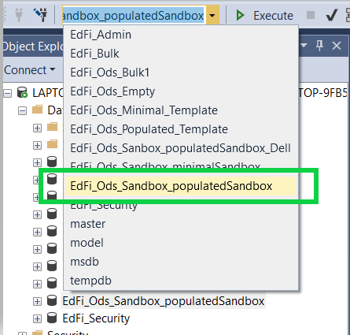

# Project Title
 **Attendance dashboard for Principal**

# Project Descriptions
 The dashboard gives the Principal of the School detailed information on School Attendance enabling the Principal in better Operational decision making. The dashboard provides various perspectives on Attendance Rate and Chronic absenteeism helping the Principal evaluate the performance of the School and identify the students who have a poor attendance record or are trending negatively on the verge of being chronically absent. 

## Project Flow Architecture

## Pre-requisites

        1) A working setup of SSMS (SQL Server Management Studio 18.x).
        2) A working setup of Ed-fi v3.x (Preferably v3.2 or v3.4) ODS. This application is compatible with v3.2 and v3.4.
                Follow the Instructions to Setup Ed-fi ODS in the Machine
                https://techdocs.ed-fi.org/display/ODSAPI32
        3) Administrator privilege to access the Ed-fi ODS Database Server.        
        4) EdFi_Ods_Populated_Template database configured as part of the Ed-fI ODS Installation.
        5) Sample data populated in the ODS for the following Tables
                a) Student
                b) schools
                c) CalendarDate
                d) StudentSchoolAttendanceEvent
                e) StudentSchoolAssociations
                f) Descriptors
        6) Tableau 2019 or higher version installed 

## Installations Instructions

### Ed-fi Installation

        Step 1) Follow the instructions to setup the Edfi ODS in the Machine
        https://techdocs.ed-fi.org/display/ODSAPI3/Getting+Started+-+Installation+Steps

        Step 2) The instructions will help you to set up following windows components and softwares that are required to build the Ed-fi ODS
                a) PowerShell 5.0
                b) Microsoft Message Queue Server Core
                c) .NET Framework 3.5
                d) Java Runtime Environment 8 or higher. 
                e) Microsoft SQL Server 2014 or higher Versions
                f) Visual Studio 2017 or 2015.

### SQL Server Management Studio

        Step 1) Go to the link https://docs.microsoft.com/en-us/sql/ssms/download-sql-server-management-studio-ssms?view=sql-server-ver15 and click on Download SQL Server Management Studio (preview 6)

        Step 2) Once downloaded, you will get a .exe file named "SSMS-Setup-ENU.exe." Double click on it

        Step 3) Click on 'Install'.

        Step 4) Installation will begin and it will display Packages progress and Overall Progress.

### Connect to SQL Server Using SSMS(Sql Server Management Studio)

        Database Connection Settings: 
        1) Server Type defaults to Database Engine
        2) Server Name - Select from the Installed Server
        3) Authentication - Leave as Windows Authentication

### Setup SqlServer Module for Powershell

        1) Go to Start -> Search Powershell -> Righ Click and Open as Administrator
        2) Run the command **Get-Module SqlServer -ListAvailable** to check if the package is already installed. Powershell will return the following output if the module is already installed

        3) If the above statement doesnt return any value, run the **Install-Module -Name SqlServer -AllowClobber** command to setup the module
        4) When prompted select 'A' as an option to complete the installation.
        5) Verify the installation by running the command  **Get-Module SqlServer -ListAvailable** once again.

## Database Object Migrations:

Database object migration can be done by executing powershell script or executing SQL through SSMS (SQL Server Management Studio)

### Database Object Migration using Powershell:

        1) On successful setup of SQLServer Module for Powershell, Navigate to the directory where the Git Repository is downloaded.
        for ex: type in **cd C:\dell-initiative\scripts**               **Note the Path provided is just for an example**
        2) Enter the following command to execute the DB object migration powershell script 

        **& "C:\dell-initiative\scripts\CreateDBObjects.ps1"**          **Note the Path provided is just for an example**
        3) Following database objects will be created in the SQL Server Database EdFi_Ods_Populated_Template

#### Tables

        1) Dell_Students
        2) Dell_Schools
        3) Dell_Lookup
        4) Dell_StudentAttendance

#### Stored Procedures

        1) StudentData
        2) SchoolData
        3) AttendanceData

### Database Object Migration using SSMS (SQL Server Management Studio):
 
        1) Open SQL Server Management Studio and enter the connection details as mentioned in the previous section.
        2) Select the database where you want to set up the DB objects for the Principal dashboard. In the following example, EdFi_Ods_Populated_Template is used.

        3) In SQL Server Management Studio select File -> Open -> Navigate to the location where the Dell_DataBaseObject.sql is downloaded
        4) Select the script and click on Execute

        5) This will create the following Objects in the database in the dbo Schema

        1) Tables
            *   Dell_Students

                    -   'Students' table stores all the Student related information. Following are the key demographics that are captured in this table

                            *   English Learner
                            *   SPED
                            *   Homeless
                            *   Economically Disadvantaged

                    -   Some of the Key Tables used are

                            *   Students
                            *   Descriptors

            *   Dell_Schools

                    -   All the demographics related to schools are captured in this table
                    -   Some of the Key Tables used are

                            *   schools
                            *   EducationOrganizations

            *   Dell_StudentAttendance

                    -   Captures student's attendance information from StudentSchoolAttendanceEvent table
                    -   Student attendance information is updated contextual to the student's enrollment

            *   Dell_Lookup

                    -   Lookup Table that helps the user to customize the application as per their source system.
                    -   Attendance code and School Year can be controlled by updating the appropriate code to this table
                    -   ***Do Not Remove value Present from the Lookup Table **
                                        
                                By Default This Table is populated with the following Values
                                
                                For Attendance 
                                
                                        a) Present Lookup Code
                                                i) In Attendance
                                                ii) Partial
                                                iii) Tardy
                                                iV) Early departure
                                                
                                        b) Excused Absence
                                                i) Excused Absence
                                        
                                        c) Unexcused Absence
                                                i) Unexcused Absence
                                                        
                                1) Insert Statement
                                
                                        To Insert any new values to this lookup table, please use the following format. Replace the values like 'In Attendance','Partial' etc from the following statement. This table maintains three different lookup values, Make sure all three values are updated or inserted.
                                                        
                                INSERT INTO Dell_lookup
                                        VALUES
                                        (
                                        'PRESENT_LOOKUP_CODE','','','In Attendance',1,'','','','Y'),
                                        (
                                        'PRESENT_LOOKUP_CODE','','','Partial',1,'','','','Y'),
                                        (
                                        'PRESENT_LOOKUP_CODE','','','Tardy',1,'','','','Y'),
                                        (
                                        'PRESENT_LOOKUP_CODE','','','Early departure',1,'','','','Y'),
                                        (
                                        'EXABS_LOOKUP_CODE','','','Excused Absence',1,'','','','Y'),
                                        (
                                        'UNEXABS_LOOKUP_CODE','','','Unexcused Absence',1,'','','','Y')
                                                
                                2) Update Statement
                                
                                        One can inactivate the Attendance code by running the following update statement.
                                        
                                        UPDATE Dell_Lookup SET ACTIVE_FLG = < Input Values Here 'Y' OR 'N' > WHERE LOOKUP_CODE_DESC = < Any Existing Lookup Code >
                                                
                                        
                                        
                                For School Year
                                
                                        a) School Year
                                                i)      2010
                                                ii)     2011
                                                iii)    2012 
                                                
                                By Default 2011 is made active, Following statements to be used for updating or inserting any new school year to this lookup table
                                        
                                1) Insert Statements
                                
                                INSERT INTO Dell_lookup
                                        VALUES
                                        (
                                        'SCHOOL_YEAR','','','School Year',2010,'','','','N'),
                                        (
                                        'SCHOOL_YEAR','','','School Year',2011,'','','','Y'),
                                        (
                                        'SCHOOL_YEAR','','','School Year',2012,'','','','N')
                                        
                                
                                2) Update Statements for School Year
                                
                                UPDATE Dell_Lookup SET LOOKUP_VALUE = < Input Values Here > WHERE LOOKUP_VALUE = < Any Existing School Year >
                                
                                3) Update Statement for Active Flag
                                
                                UPDATE Dell_Lookup SET ACTIVE_FLG = < Input Values Here 'Y' OR 'N' > WHERE LOOKUP_VALUE = < Any Existing School Year >

## Populate Sample data in to EdFi_Ods_Populated_Template

        By Default Edfi ODS is not populated with any sample data for calendarDate table in v3.2 or 3.4 versions. Follow the below steps to populate the sample data to the Edfi ODS table such that the application can be validated.

        1) Open powershell in Administrator mode, Navigate to the directory where the Git Repository is downloaded
        2) Run the following command to populate the sample data required for EdFi_Ods_Populated_Template

        **& "C:\dell-initiative\scripts\LoadSampleData.ps1"**           **Note the Path provided is just for an example**
        3) Above script will add entry in the following tables 

### Tables
        
        1) Calendar
        2) calendarDate
        3) StudentSchoolAttendanceEvent
        
## StoreProcedure
		
        The following are the list of Stored Procedures that gets created when the database objects for the principal dashboard is loaded to the application. These procedures can be invoked using invokeprocedures.ps1 file which is available in the script directory. This PowerShell script can be invoked using the following statements.
        
        Navigate to the directory where the project has been checked out. Double click on the script directory to open the folder. Look for InvokeProcedures.ps1 file. This file invokes the following procedures and loads data into Dell_StudentAttendance, Dell_Schools, and Dell_Students Tables.
                        
                
            *   StudentData
                -   Loads Student Related data to the Dell_Students Table - Full Refresh Load

            *   SchoolData
                -   Loads School Related data to the Dell_Schools Table - Full Refresh Load

            *   AttendanceData
                -   Loads Attendance Related Data to the Dell_StudentAttendance Table - Yearly Full Refresh
                                        
        Steps to Invoke the Procedures through PowerShell
        
        1) Type Powershell in the windows search bar, right-click and open PowerShell in Administrator mode.
        2) Navigate to the path where the project is checked out.
        
                for ex: cd c:\dell-initiative\scripts   **Note the Path provided is just for an example**
        3) In PowerShell, type the following and hit enter
        
                for ex: & "c:\dell-initiative\scripts\InvokeProcedures.ps1"             **Note the Path provided is just for an example**
        4) This script will invoke the procedures and load the Students, Schools, and Attendance table. 
                

# Production Migration

##   Tableau server 2019.4 

        Step 1: Follow the link https://help.tableau.com/current/server/en-us/install_config_top.htm and Run Server Setup
        Choose an installation path
        Create a new Tableau Server installation, and then click Next.
        Click Install.
        Step 2: Sign-in to TSM
        Step 3: Activate and register Tableau Server
        Step 4: Configure essential Tableau Server settings
        Step 5: Create a Tableau Server administrator user
        Your server is installed!

##   Tableau Dashboard:

        1) Launch the Tableau Dashboard
        2) Navigate to the DataSource Tab
        3) Application Prompts for the Database Connection Details
        4) Update the connection details if required, Save, and refresh. 
        5) Dashboard 1 and Dashboard 2 will be populated with the data.
        6) Dashboard 1 shows the summarized information at the school level
        7) Dashboard 2 shows the data at the student level
        8) Users can select on any of the students from the student's list chart to know more details about the particular student's.

 

